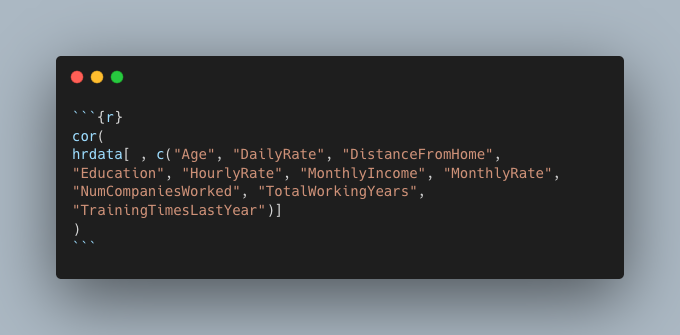
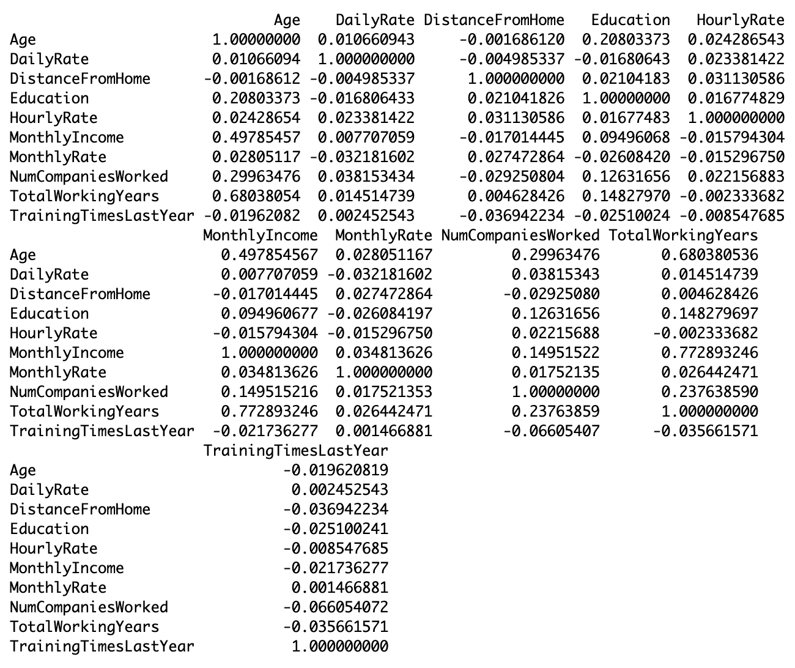
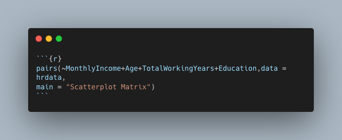
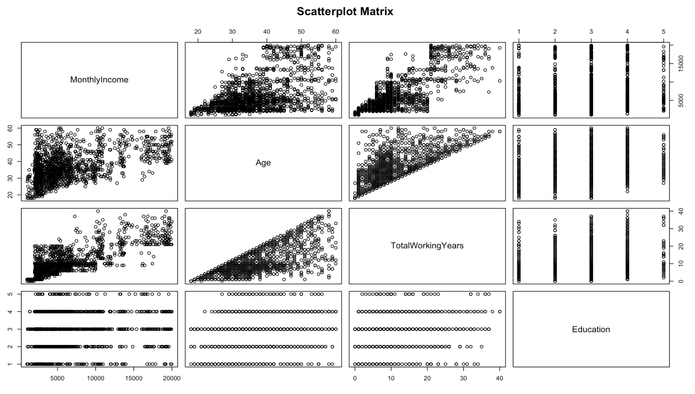
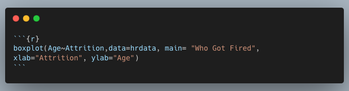
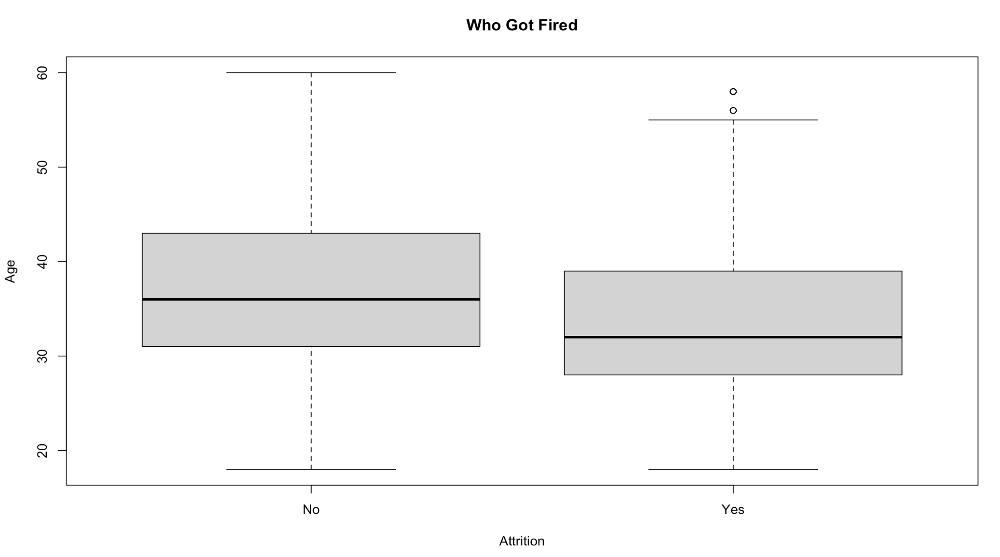
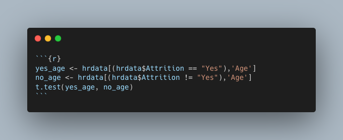
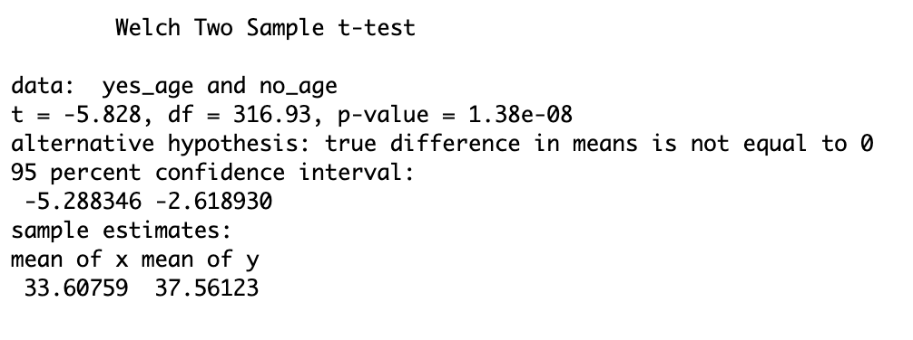
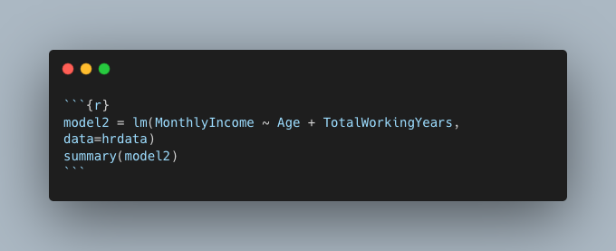
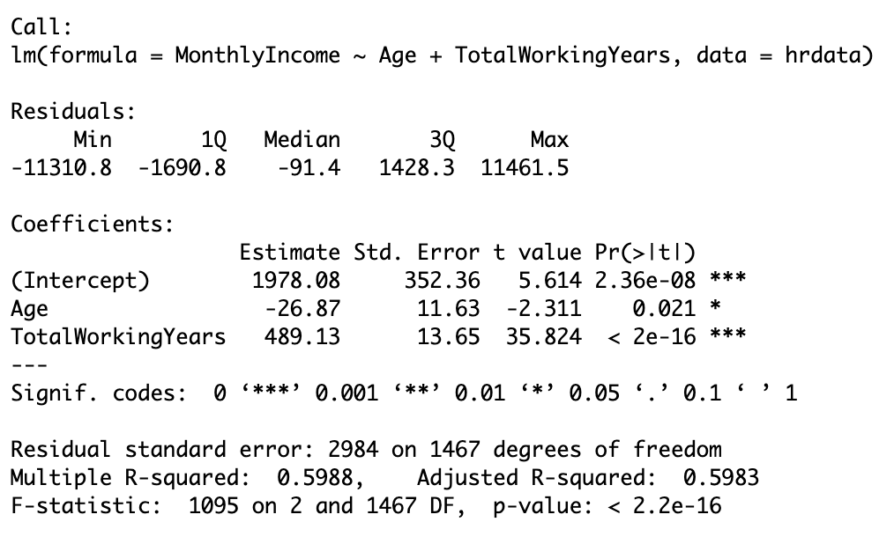

# Analyzing Human Resources Data through R
 

---

## Introduction

The set up for this project is that I'm a fresh, new data analyst intern for IBM in their human resources department. The overall goal of my tasks are to answer the questions posed to me by management and use **[R](https://www.r-project.org/)** and **[R Studio](https://posit.co/download/rstudio-desktop/)**, a popular IDE, to do so.

 

## About The Data

The data for this project can be found **[here](https://www.kaggle.com/datasets/pavansubhasht/ibm-hr-analytics-attrition-dataset)**. It's a fictional data set created by IBM data scientists.

 

## Key Highlights

- There's a correlation between:
  
    - `Age-TotalWorkingYears`
    - `MonthlyIncome-TotalWorkingYears`
    - `Age-MonthlyIncome`
- Ageism did not play a role in recent lay offs.
- The longer someone has worked and the older they are would likely mean they earn more income

 

## Analysis

The first step in my analysis after loading in my csv file is answering the question if any of the demographics data **[correlate](https://en.wikipedia.org/wiki/Correlation)**. This can be done quickly and easiliy in R with the **[cor](https://www.rdocumentation.org/packages/stats/versions/3.6.2/topics/cor)** function. To pass only the data from the columns I want to analyze I'll use **[indexing](https://www.geeksforgeeks.org/how-to-select-dataframe-columns-by-index-in-r/#)** and create a new dataframe. The final command used is shown in Figure 1. The results are shown in Figure 2. The closer a value is to 1 or -1 the stronger the relationship is between the two variables. Relationships such as `Age-TotalWorkingYears`, `MonthlyIncome-TotalWorkingYears`, and `Age-MonthlyIncome`, etc. stand out to me.

 

**Figure 1:** R cor function on only the columns wanted for analysis

 

**Figure 2:** cor function results

 

After identifying a handful of strong relationships using the cor function, we can learn more about them through scatter plots. Again, R makes this very easy to do thanks to the **[pairs](https://www.rdocumentation.org/packages/graphics/versions/3.6.2/topics/pairs)** function. Figure 3 shows the use of the pairs function and Figure 4 shows the resulting scatter plots.

There's a positive correlation between age and montly income. There's also a strong, positive correlation between age and total working years.

 

**Figure 3:** pairs function specifying data and columns from said data to be used and the title of the resulting graph

 

**Figure 4:** scatter plots for monthly income, age, total working years, and education

 

Moving on, the next task was to explore the data and determine if recent layoffs included a majority of older employees. One of the employees who was affected is claiming ageism was at play. To determine if this was truly the case a box plot of the age distribution of those who were laid off and those who were retained can be utilized. You may have already guessed it, but to do this all that's needed is R's **[boxplot](https://www.rdocumentation.org/packages/graphics/versions/3.6.2/topics/boxplot)** function. Figure 5 shows how the function was used and Figure 6 shows the resulting box plot.

 

**Figure 5:** boxplot function

 

**Figure 6:** resulting box plot

 

The median value for the ages of those who were laid off is lower than those who were not, but not by much. To test this further and find out if there's any significance, a **[Welch's t-test](images/daa_module8/r_boxplot_result.png)** can be performed in R using the **[t.test](https://www.rdocumentation.org/packages/stats/versions/3.6.2/topics/t.test)** function. After creating two new sample variables, yes_age and no_age, the function can be used and is seen in Figure 7 and the results in Figure 8. It can be seen in Figure 8 that the p-value is less than 0.05 indicating there is a statistical significant difference between the two samples. We can also see here that the median ages are 33.6 for those who where laid off and 37.5 for those who were retained. No ageism seems to be at play here.

 

**Figure 7:** Welch t-test function

 

**Figure 8:** Welch t-test result

 

My last task was to exercise my multivariate linear regression skills in R with creating a model to predict monthly income based on age and total years working. The function to use here is **[lm](https://www.rdocumentation.org/packages/stats/versions/3.6.2/topics/lm)**. Figure 9 shows the R snippet used and Figure 10 shows the results. The p-value again here is less than 0.05 and indicates the results are statistically significant. The R2 value is showing 60% meaning 40% of the variance in this data cannot be explained by the model. While an R2 value of 1 would indicate a perfect model, 0.6, or 60%, is still a good indicator there is a significant relationship between these variables. In the case of predicting one's monthly income based on their age and total years working, you could intuitvely predict someones monthly income is greater the older they are and the longer they've worked.

 

**Figure 9:** R code snippet showing the creation of the model

 

**Figure 10:** multivariate linear regression results

 

## Conclusion

R is a very useful and powerful statistic tool. Answering the questions posed to me in this challenge was very easy and quick to complete thanks to R. What did you think of my analysis? Are there any strong relationships I missed or that you think would be worth further investigation?

If you have any feedback or comments for me, please feel free to **[reach out](https://www.linkedin.com/in/gregory-santoro/)!** Or if you want to help keep me **[caffeinated](https://www.buymeacoffee.com/gregoryvsantoro)**, I'd be very grateful!
