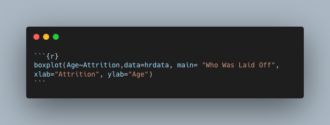
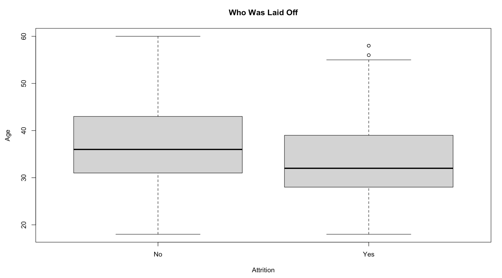

# Analyzing Human Resources Data through R
 

---

## Introduction

The set up for this project is that I'm a fresh, new data analyst intern for IBM in their human resources department. The overall goal of my tasks are to answer the questions posed to me by management and use **[R](https://www.r-project.org/)** and **[R Studio](https://posit.co/download/rstudio-desktop/)**, a popular IDE, to do so.

 

## About The Data

The data for this project can be found **[here](https://www.kaggle.com/datasets/pavansubhasht/ibm-hr-analytics-attrition-dataset)**. It's a fictional data set created by IBM data scientists.

 

## Key Highlights

- 1
- 2
- 3
- 4

 

## Analysis

The first step in my analysis after loading in my csv file is answering the question if any of the demographics data **[correlate](https://en.wikipedia.org/wiki/Correlation)**. This can be done quickly and easiliy in R with the **[cor](https://www.rdocumentation.org/packages/stats/versions/3.6.2/topics/cor)** function. To pass only the data from the columns I want to analyze I'll use **[indexing](https://www.geeksforgeeks.org/how-to-select-dataframe-columns-by-index-in-r/#)** and create a new dataframe. The final command used is shown in Figure 1. The results are shown in Figure 2. The closer a value is to 1 or -1 the stronger the relationship is between the two variables. Relationships such as `Age-TotalWorkingYears`, `MonthlyIncome-TotalWorkingYears`, and `Age-MonthlyIncome`, etc. stand out to me.

 

**Figure 1:** R cor function on only the columns wanted for analysis

 

**Figure 2:** cor function results

 

After identifying a handful of strong relationships using the cor function, we can learn more about them through scatter plots. Again, R makes this very easy to do thanks to the **[pairs](https://www.rdocumentation.org/packages/graphics/versions/3.6.2/topics/pairs)** function. Figure 3 shows the use of the pairs function and Figure 4 shows the resulting scatter plots.

There's a positive correlation between age and montly income. There's also a strong, positive correlation between age and total working years.

 

**Figure 3:** pairs function specifying data and columns from said data to be used and the title of the resulting graph

 

 

**Figure 4:** scatter plots for monthly income, age, total working years, and education

 

Moving on, the next task was to explore the data and determine if recent layoffs included a majority of older employees. One of the employees who was affected is claiming ageism was at play. To determine if this was truly the case a boxplot of the age distribution of those who were laid off and those who were retained can be utilized. You may have already guessed it, but to do this all that's needed is R's **[boxplot](https://www.rdocumentation.org/packages/graphics/versions/3.6.2/topics/boxplot)** function.

 

 

**Figure 5:** boxplot function

 

 

**Figure 6:** resulting box plot

 

## Conclusion

text

If you have any feedback or comments for me, please feel free to [reach out](https://www.linkedin.com/in/gregory-santoro/)!
