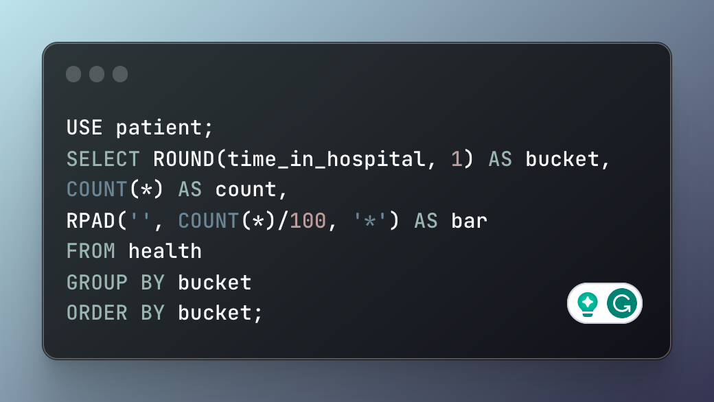
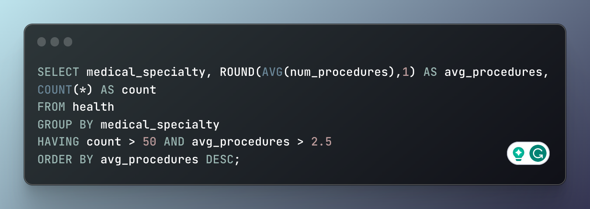
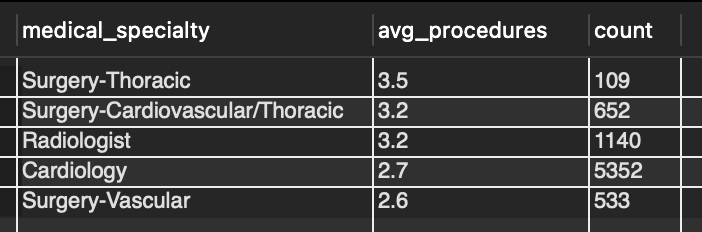

# SQL Exploration of a Healthcare Data Set

---

## Introduction
In this project the scenario was I have just been hired as data analyst for a hospital. I have just been given my first tasks to complete and they all revolve around the use of SQL. The specific flavor of SQL used here is MySQL.

## About The Dataset

This data set used for this project contains two tables. One contains patient demographic information while the other contains all of a patients various health information. You can find the original data set [here](https://www.kaggle.com/code/iabhishekofficial/prediction-on-hospital-readmission/data?select=diabetic_data.csv).

## Key Insights

- The majority of patients are discharged from the hospital in less than 7 days
- The thoracic surgery department has the highest average number of procedures
- There is no correlation between a patients race and the number of lab procedures performed

## Analysis

### Length of Patient Stay

A hospital can treat only as many patients as they have room for. This is typically measured by how many beds or rooms they have. My first task was to find out if a majority of patients are admitted for more than 7 days. An effective way to show this visually is with a histogram, but the goal here is to only work within SQL to complete this analysis.  SQL is not a data visualization tool, but in this case there are some options available to create a crude, yet effective visualization showing the average length of a patient's stay. Figure 1 shows the SQL used to create Table 1, a histogram showcasing that most patinents do not stay for 7 days or more.

  **Figure 1:** SQL code snippet to create the histogram showing the number of patients who stay between 1 and 14 days

  **Table 1:** A SQL-generated histogram illustrating the frequency of patient admissions based on the duration of stay

|  days  | count | bar                                                                               |
|--------|-------|-----------------------------------------------------------------------------------|
| 1      | 14208 | ******************************************************************************************************************************************** |
| 2      | 17224 | ******************************************************************************************************************************************************************** |
| 3      | 17756 | ********************************************************************************************************************************************************************************** |
| 4      | 13924 | ******************************************************************************************************************************************* |
| 5      | 9966  | ************************************************************************************************************** |
| 6      | 7539  | ***************************************************************************************** |
| 7      | 5859  | ***************************************************************** |
| 8      | 4391  | ************************************************* |
| 9      | 3002  | ************************* |
| 10     | 2342  | ******************** |
| 11     | 1855  | ************* |
| 12     | 1448  | ************ |
| 13     | 1210  | ********** |
| 14     | 1042  | ******** |

 
### Identifying Top 5 Specialties

The next task was to determine the average number of procedures done by each medical specialty and then identify the departments that perform the most procedures on average. Figure 2 shows the SQL used to identify the top 5 and Table 3 is the resulting table. The clause `HAVING` is what specifically allows this query to be give us the desired information. `HAVING` is similar to the `WHERE` clause but for filtering aggregated data.

**Figure 2:** SQL snippet used to identify top 5 specialties of the hospital based on their high average number of procedures performed

**Table 3:** Resulting table from SQL snippet in Figure 2

---

under_construction

### Conclusion

under_construction

If you have any feedback or comments for me, please feel free to [reach out](https://www.linkedin.com/in/gregory-santoro/)!
