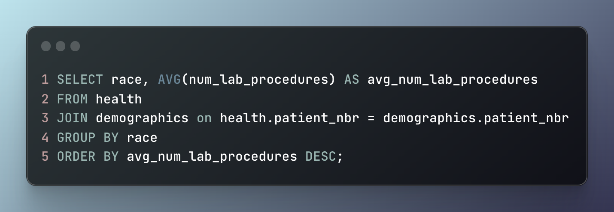
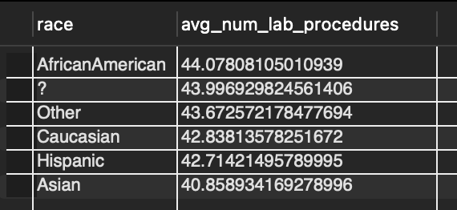
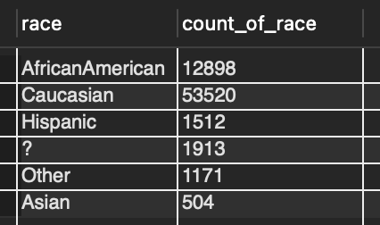

# SQL Exploration of a Healthcare Data Set

---

## Introduction
In this project the scenario was I have just been hired as data analyst for a hospital and been given a list of questions to answer by the hospital director. The job relies heavily on the use of SQL. The specific flavor of SQL used here is MySQL. The questions are as follows:

1. How many patients stay longer than 7 days?
2. What specialties are doing the most procedures on average?
3. Does a patient's demographic play a role in the number of lab tests they recieve?

## About The Dataset

This data set used for this project contains two tables. One contains patient demographic information while the other contains all of a patients various health information. You can find the original data set [here](https://www.kaggle.com/code/iabhishekofficial/prediction-on-hospital-readmission/data?select=diabetic_data.csv).

## Key Insights

- The majority of patients are discharged from the hospital in less than 7 days
- The thoracic surgery department has the highest average number of procedures
- There is no correlation between a patients race and the number of lab procedures performed

## Analysis

### 1. Length of Patient Stay

A hospital can treat only as many patients as they have room for. This is typically measured by how many beds or rooms they have. My first question to answer was to find out if a majority of patients are admitted for more than 7 days. An effective way to show this visually is with a histogram, but the goal here is to only work within SQL to complete this analysis.  SQL is not a data visualization tool, but in this case there are some options available to create a crude, yet effective visualization showing the average length of a patient's stay.

Figure 1 shows the SQL used to create Table 1, a histogram showcasing that most patinents do not stay for 7 days or more. [`RPAD`](https://www.w3schools.com/sql/func_mysql_rpad.asp) is what's used to create the bar column of the histogram. It has three inputs. If you look at line 4 in Figure 1 you'll see the first input is the string `''`, or a open and closed single quotation mark. This input would normally contain text that is considered the original string which `RPAD` would then right pad the third input to.  You could think of it as being similar to `CONCAT` or concatenating two strings together.  Last but not least, is the second input which controls the length of the string after being right padded.

So for our example in Figure 1, `''` is the first input indicating there's no original string to right pad our third input and string , `*`, to. An asterisk in this case being used to represent bars on a histogram.  The second input `COUNT(*)/100` is not setting a limit on string length but instead indicates take the values found from line 3 and divide them by 100 to make a more manageable table.

  **Figure 1:** SQL code snippet to create the histogram showing the number of patients who stay between 1 and 14 days

 
<head>
  <link rel="stylesheet" type="text/css" href="styles.css">
</head>
<body>
  

    <table>
  **Table 1:** A SQL-generated histogram illustrating the frequency of patient admissions based on the duration of stay
  
|  days  | count | bar                                                                               |
|--------|-------|-----------------------------------------------------------------------------------|
| 1      | 14208 | ******************************************************************************************************************************************** |
| 2      | 17224 | ******************************************************************************************************************************************************************** |
| 3      | 17756 | ********************************************************************************************************************************************************************************** |
| 4      | 13924 | ******************************************************************************************************************************************* |
| 5      | 9966  | ************************************************************************************************************** |
| 6      | 7539  | ***************************************************************************************** |
| 7      | 5859  | ***************************************************************** |
| 8      | 4391  | ************************************************* |
| 9      | 3002  | ************************* |
| 10     | 2342  | ******************** |
| 11     | 1855  | ************* |
| 12     | 1448  | ************ |
| 13     | 1210  | ********** |
| 14     | 1042  | ******** |
    </table>
  

</body>
     
 
### 2. Identifying Top 5 Specialties

The next question posed to me was to determine the average number of procedures done by each medical specialty and then identify the departments that perform the most procedures on average. Figure 2 shows the SQL used to identify the top 5 and Table 2 is the resulting table. The clause `HAVING` is what specifically allows this query to display the desired information. `HAVING` is similar to the `WHERE` clause but for filtering aggregated data.

**Figure 2:** SQL snippet used to identify top 5 specialties of the hospital based on their high average number of procedures performed

 
**Table 2:** Resulting table from SQL snippet in Figure 2

---

### 3. Does A Patient's Demographic Influence Their Number of Lab Tests

This third question posed to me specifically asks if there is a difference in the number of lab tests recieved depending on a patients race. The two tables in the data set separate the demograhpics data from health data. To answer this then a `JOIN` must be used. Figure 3 shows how I achieved this. The column `patient_nbr` exists on both tables making a `JOIN` possible. Table 3 shows the resulting table where at a glance it doesn't appear there is a disparity between these two variables. One thing to note is there's a `?` in the race column that represents values where the race of the patient is missing from the data set and recorded as such. Table 4 shows the count of each race in the data set. The missing race data only accounts for 2.7% of all patients potentially indicating if those races were recorded that it would not drastically change the results from the query.

**Figure 3:** SQL snippet showing how to create table higlighting race categories and the average number of lab tests performed

 
**Table 3:** Results of Figure 3 SQL snippet

 
**Table 4:** Count of races in data set

 

---

## Conclusion

This is a large data set that could be used to answer a wide variety of questions. The ones posed to me in this hypothetical situation barely scratch the surface but serve to highlight a few of the ways SQL allow us to pull data from different tables very quickly and easily. What other questions do you think could be answered with this data set? And what queries would you use to answer those?

If you have any feedback or comments for me, please feel free to [reach out](https://www.linkedin.com/in/gregory-santoro/)!
