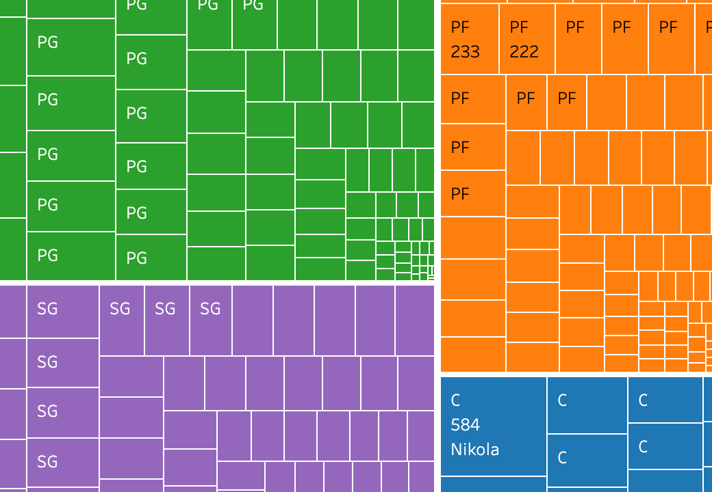

<!--
---
title:
author: Gregory Santoro
date: 2023-05-30
---
-->
# From the Bench to the Dashboard: Analyzing the Utah Jazz with Tableau
 

---

## Introduction

When it comes to sports I prefer the kind where you kick a ball rather than throw it. But in this project prompted to me by the wonderful [Data Career Jumpstart Bootcamp](https://www.datacareerjumpstart.com/), I wasn't asked to complete an analysis for AFC Richmond, but the Utah Jazz, a basketball team! I'll be pretending that I'm interviewing for a data analyst position with them and create some visualizations using Tableau as part of the process.
 
## About the Data Set

The data comes from [basketball-reference.com](https://www.basketball-reference.com/leagues/NBA_2022_totals.html). It's a summary of player stats data from the NBA 2021-2022 season. One thing worth noting about the data is that players who got traded mid-season will have three rows of data.  One for each team they played for and another that combines those two rows for a total stats overview. The full glossary for each piece of data can be scrolled through below.
 
<ul style="height: 250px; overflow-y: scroll;">
  <li>Rk -- Rank</li>
  <li>Pos -- Position</li>
  <li>Age -- Player's age on February 1 of the season</li>
  <li>Tm -- Team</li>
  <li>G -- Games</li>
  <li>GS -- Games Started</li>
  <li>MP -- Minutes Played</li>
  <li>FG -- Field Goals</li>
  <li>FGA -- Field Goal Attempts</li>
  <li>FG% -- Field Goal Percentage</li>
  <li>3P -- 3-Point Field Goals</li>
  <li>3PA -- 3-Point Field Goal Attempts</li>
  <li>3P% -- 3-Point Field Goal Percentage</li>
  <li>2P -- 2-Point Field Goals</li>
  <li>2PA -- 2-point Field Goal Attempts</li>
  <li>2P% -- 2-Point Field Goal Percentage</li>
  <li>eFG% -- Effective Field Goal Percentage*</li>
  <li>FT -- Free Throws</li>
  <li>FTA -- Free Throw Attempts</li>
  <li>FT% -- Free Throw Percentage</li>
  <li>ORB -- Offensive Rebounds</li>
  <li>DRB -- Defensive Rebounds</li>
  <li>TRB -- Total Rebounds</li>
  <li>AST -- Assists</li>
  <li>STL -- Steals</li>
  <li>BLK -- Blocks</li>
  <li>TOV -- Turnovers</li>
  <li>PF -- Personal Fouls</li>
  <li>PTS -- Points</li>
</ul>
 
_*This statistic adjusts for the fact that a 3-point field goal is worth one more point than a 2-point field goal_
  
## Key Highlights

- The Toronto Raptors and Washington Wizards should reconsider the players they placed as shooting guards. They had the lowest 3-pt percentage.

- Nikola Jokić is an outlier in terms of being a center position player, but scoring as many points as most point guards

- Trae Young (PG), Giannis Antetokounmpo (PF), Khris Middleton (SF), Tyrese Haliburton (SG), and Nikola Jokić (C) lead in assists.

- Trae Young scored the most points in the season.

 
## Analysis

  **Objectives:**
  
   - Easily identify 3-pt percentage by position on each team
   
   - Highlight total points, assists, and rebounds scored by each player
   
   - Breakdown assists by positon and individual players
   
   - Showcase the total points scored by each team and players on that team

As noted about the data set, there's a total of three rows per player for players who were traded mid-season. Depending on the visualization being created, this can cause a few issues.  For example, say I wanted to showcase the 3 point field goal percentage, the total 3 point shots made versus how many were attempted, broken up by the positions on each team represented in the data set. Table 1 shows this, but if you know anything about basketball you can probably spot something amiss when you start to scroll right. If you're like me and haven't a clue (how did I land this interview? &#128579;) then I'll point it out. There are a total of 12 positions listed in Table 1. Basketball only has [five positions](https://jr.nba.com/basketball-positions/). The reason 12 positions are showing is because players who are traded may end up playing a different position on their new team. This can be addressed by filtering out these hyphenated positions with Tableau's filter tool. Another filter necessary for most of the analysis was the fact there was a team labeled "TOT" that was a summation of all team data, but not actually a team.

 
**Table 1:** 3-point percentage of each position on each team

  <table style="width: 100%;">
      <tr>
        <th></th>
        <th colspan="12">Position</th>
      </tr>
      <tr>
        <th>Tm</th>
        <th>C</th>
        <th>C-PF</th>
        <th>PF</th>
        <th>PF-SF</th>
        <th>PG</th>
        <th>PG-SG</th>
        <th>SF</th>
        <th>SF-SG</th>
        <th>SG</th>
        <th>SG-PG</th>
        <th>SG-PG-SF</th>
        <th>SG-SF</th>
      </tr>
      <tr>
        <td>ATL</td>
        <td>0.2130</td>
        <td></td>
        <td>0.3253</td>
        <td></td>
        <td>0.3040</td>
        <td></td>
        <td>0.3484</td>
        <td></td>
        <td>0.3445</td>
        <td></td>
        <td></td>
        <td></td>
      </tr>
      <tr>
        <td>BOS</td>
        <td>0.3488</td>
        <td></td>
        <td>0.3945</td>
        <td></td>
        <td>0.3715</td>
        <td></td>
        <td>0.2688</td>
        <td></td>
        <td>0.3260</td>
        <td></td>
        <td></td>
        <td></td>
      </tr>
      <tr>
        <td>BRK</td>
        <td>0.1970</td>
        <td></td>
        <td>0.3133</td>
        <td></td>
        <td>0.3138</td>
        <td></td>
        <td>0.4280</td>
        <td></td>
        <td>0.2776</td>
        <td></td>
        <td></td>
        <td></td>
      </tr>
      <tr>
        <td>CHI</td>
        <td>0.2570</td>
        <td></td>
        <td>0.2394</td>
        <td></td>
        <td>0.3433</td>
        <td></td>
        <td>0.3413</td>
        <td></td>
        <td>0.3708</td>
        <td></td>
        <td></td>
        <td></td>
      </tr>
      <tr>
        <td>CHO</td>
        <td>0.2163</td>
        <td></td>
        <td>0.2950</td>
        <td></td>
        <td>0.3953</td>
        <td></td>
        <td>0.3000</td>
        <td></td>
        <td>0.3605</td>
        <td></td>
        <td></td>
        <td></td>
      </tr>
      <tr>
        <td>CLE</td>
        <td>0.1640</td>
        <td></td>
        <td>0.2953</td>
        <td></td>
        <td>0.2825</td>
        <td></td>
        <td>0.2830</td>
        <td></td>
        <td>0.2415</td>
        <td></td>
        <td></td>
        <td></td>
      </tr>
      <tr>
        <td>DAL</td>
        <td>0.3670</td>
        <td></td>
        <td>0.2805</td>
        <td></td>
        <td>0.1870</td>
        <td></td>
        <td>0.2983</td>
        <td></td>
        <td>0.2857</td>
        <td></td>
        <td></td>
        <td></td>
      </tr>
      <tr>
        <td>DEN</td>
        <td>0.3305</td>
        <td></td>
        <td>0.3339</td>
        <td></td>
        <td>0.3480</td>
        <td></td>
        <td>0.1040</td>
        <td></td>
        <td>0.3908</td>
        <td></td>
        <td></td>
        <td></td>
      </tr>
      <tr>
        <td>DET</td>
        <td>0.2473</td>
        <td></td>
        <td>0.3053</td>
        <td></td>
        <td>0.2614</td>
        <td></td>
        <td>0.3333</td>
        <td></td>
        <td>0.2643</td>
        <td></td>
        <td></td>
        <td></td>
      </tr>
      <tr>
        <td>GSW</td>
        <td>0.1810</td>
        <td></td>
        <td>0.3330</td>
        <td></td>
        <td>0.2337</td>
        <td></td>
        <td>0.3203</td>
        <td></td>
        <td>0.3347</td>
        <td></td>
        <td></td>
        <td></td>
      </tr>
      <tr>
        <td>HOU</td>
        <td>0.2323</td>
        <td></td>
        <td>0.2810</td>
        <td></td>
        <td>0.3697</td>
        <td></td>
        <td>0.3190</td>
        <td></td>
        <td>0.3364</td>
        <td></td>
        <td></td>
        <td></td>
      </tr>
      <tr>
        <td>IND</td>
        <td>0.3113</td>
        <td></td>
        <td>0.3377</td>
        <td></td>
        <td>0.3219</td>
        <td></td>
        <td>0.3227</td>
        <td></td>
        <td>0.3053</td>
        <td></td>
        <td></td>
        <td></td>
      </tr>
      <tr>
        <td>LAC</td>
        <td>0.4270</td>
        <td></td>
        <td>0.3696</td>
        <td></td>
        <td>0.3130</td>
        <td></td>
        <td>0.4700</td>
        <td></td>
        <td>0.3646</td>
        <td></td>
        <td></td>
        <td></td>
      </tr>
      <tr>
        <td>LAL</td>
        <td>0.2695</td>
        <td></td>
        <td>0.3625</td>
        <td></td>
        <td>0.2436</td>
        <td></td>
        <td>0.2110</td>
        <td></td>
        <td>0.3341</td>
        <td></td>
        <td></td>
        <td></td>
      </tr>
      <tr>
        <td>MEM</td>
        <td>0.1570</td>
        <td></td>
        <td>0.2410</td>
        <td></td>
        <td>0.3670</td>
        <td></td>
        <td>0.2390</td>
        <td></td>
        <td>0.2644</td>
        <td></td>
        <td></td>
        <td></td>
      </tr>
      <tr>
        <td>MIA</td>
        <td>0.1863</td>
        <td></td>
        <td>0.3647</td>
        <td></td>
        <td>0.4223</td>
        <td></td>
        <td>0.3443</td>
        <td></td>
        <td>0.3813</td>
        <td></td>
        <td></td>
        <td></td>
      </tr>
      <tr>
        <td>MIL</td>
        <td>0.3433</td>
        <td></td>
        <td>0.3210</td>
        <td></td>
        <td>0.3019</td>
        <td></td>
        <td>0.3518</td>
        <td></td>
        <td>0.4062</td>
        <td></td>
        <td></td>
        <td></td>
      </tr>
      <tr>
        <td>MIN</td>
        <td>0.3765</td>
        <td></td>
        <td>0.2860</td>
        <td></td>
        <td>0.3753</td>
        <td></td>
        <td>0.2535</td>
        <td></td>
        <td>0.3565</td>
        <td></td>
        <td></td>
        <td></td>
      </tr>
      <tr>
        <td>NOP</td>
        <td>0.3483</td>
        <td></td>
        <td>0.4123</td>
        <td></td>
        <td>0.3183</td>
        <td></td>
        <td>0.2273</td>
        <td></td>
        <td>0.3083</td>
        <td></td>
        <td></td>
        <td></td>
      </tr>
      <tr>
        <td>NYK</td>
        <td>0.2460</td>
        <td></td>
        <td>0.3880</td>
        <td></td>
        <td>0.3963</td>
        <td></td>
        <td>0.2040</td>
        <td></td>
        <td>0.2945</td>
        <td></td>
        <td></td>
        <td></td>
      </tr>
      <tr>
        <td>OKC</td>
        <td>0.3213</td>
        <td></td>
        <td>0.3540</td>
        <td></td>
        <td>0.2956</td>
        <td></td>
        <td>0.2923</td>
        <td></td>
        <td>0.2868</td>
        <td></td>
        <td></td>
        <td></td>
      </tr>
      <tr>
        <td>ORL</td>
        <td>0.2385</td>
        <td></td>
        <td>0.2395</td>
        <td></td>
        <td>0.3125</td>
        <td></td>
        <td>0.3900</td>
        <td></td>
        <td>0.2300</td>
        <td></td>
        <td></td>
        <td></td>
      </tr>
      <tr>
        <td>PHI</td>
        <td>0.3100</td>
        <td></td>
        <td>0.4167</td>
        <td></td>
        <td>0.3057</td>
        <td></td>
        <td>0.2977</td>
        <td></td>
        <td>0.3073</td>
        <td></td>
        <td></td>
        <td></td>
      </tr>
      <tr>
        <td>PHO</td>
        <td>0.2890</td>
        <td></td>
        <td>0.3750</td>
        <td></td>
        <td>0.2175</td>
        <td></td>
        <td>0.3760</td>
        <td></td>
        <td>0.2677</td>
        <td></td>
        <td></td>
        <td></td>
      </tr>
      <tr>
        <td>POR</td>
        <td>0.3435</td>
        <td></td>
        <td>0.3770</td>
        <td></td>
        <td>0.3548</td>
        <td></td>
        <td>0.3125</td>
        <td></td>
        <td>0.3704</td>
        <td></td>
        <td></td>
        <td></td>
      </tr>
      <tr>
        <td>SAC</td>
        <td>0.3153</td>
        <td></td>
        <td>0.2500</td>
        <td></td>
        <td>0.3604</td>
        <td></td>
        <td>0.2605</td>
        <td></td>
        <td>0.3775</td>
        <td></td>
        <td></td>
        <td></td>
      </tr>
      <tr>
        <td>SAS</td>
        <td>0.2567</td>
        <td></td>
        <td>0.3327</td>
        <td></td>
        <td>0.3233</td>
        <td></td>
        <td>0.3030</td>
        <td></td>
        <td>0.2453</td>
        <td></td>
        <td></td>
        <td></td>
      </tr>
      <tr>
        <td>TOR</td>
        <td>0.2600</td>
        <td></td>
        <td>0.3135</td>
        <td></td>
        <td>0.2530</td>
        <td></td>
        <td>0.4160</td>
        <td></td>
        <td>0.2550</td>
        <td></td>
        <td></td>
        <td></td>
      </tr>
      <tr>
        <td>UTA</td>
        <td>0.3615</td>
        <td></td>
        <td>0.3440</td>
        <td></td>
        <td>0.3165</td>
        <td></td>
        <td>0.2450</td>
        <td></td>
        <td>0.3985</td>
        <td></td>
        <td></td>
        <td></td>
      </tr>
      <tr>
        <td>WAS</td>
        <td>0.3213</td>
        <td></td>
        <td>0.3610</td>
        <td></td>
        <td>0.2807</td>
        <td></td>
        <td>0.2823</td>
        <td></td>
        <td>0.3296</td>
        <td></td>
        <td></td>
        <td></td>
      </tr>
    </table>

 

The first objective was to create an easy way to identify what position is most efficient at scoring 3-pointers for each team. To do this a table will suffice, but adding color can help make it that much easier to navigate and quickly decipher the information one may need. Figure 1 shows the a snippet of the final product. All that was needed to make this is placing player positions in the column shelf, teams in the row shelf, and placing the 3-pt percentage as an averge in the color and text cards. And voilà, an easily created table that is quick to read!

**Figure 1:** Snippet of final product for the highlight table of a team's positions 3-pt percentage

The next objective was to highlight the relationship between points, assists, and rebounds made by all players. A scatter plot is a great tool to show the relationship between two variables, but what about showing a relationship between three? This is where a bubble plot comes in handy. This can show a third variable using the size of each marker. On the x-axis we have points scored, y-axis has assists, and the sum of "TRB," or total rebounds, is placed in the size card. All resulting in Figure 2, where we can see a portion of the resulting bubble plot.

**Figure 2:** Bubble plot showing relation between points, assists, and rebounds scored

The third objective involves the use of a [treemap](https://en.wikipedia.org/wiki/Treemapping). This visualization effectively shows hierarchical data.

**Figure 3:**

text

**Figure 4:**

  
## Conclusion

Sports generate so much data that they're a statistics gold mine. There's a lot of information that can be gleaned from such countless data and knowing how to make use of it can really make a difference for a team's success moving forward into the next season. I'm still not a basketball fan or expert, but I certainly can appreciate players like Nikola Jokić or Trae Young for being at the absolute top of their game.

If you were to tackle a sports visualization project, would you choose basketball or another sport? What questions would you hope to answer?

To see the full story on Tableau, click [here](https://public.tableau.com/views/nba21-22/NBA2021-2022SeasonAnalysis?:language=en-US&:display_count=n&:origin=viz_share_link)!

If you have any feedback or comments for me, please feel free to [reach out](https://www.linkedin.com/in/gregory-santoro/)!
